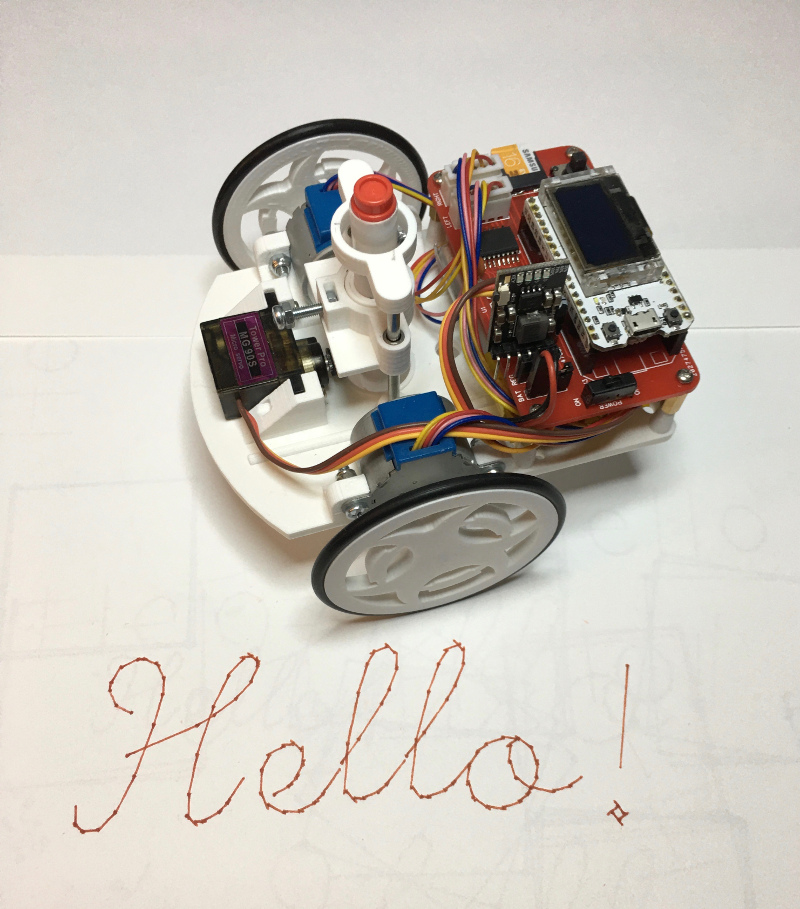

TurtlePlotBot
=============

The TurtlePlotBot is an MicroPython based 3D printed drawing robot inspired
by `MakersBox's <https://www.thingiverse.com/MakersBox>`_ `Arduino Chassis
for Drawing Robot <https://www.thingiverse.com/thing:1091401>`_. The
TurtlePlotBot can be easily built in a couple of hours and offers a fun
environment to learn python programming and robotics.

|

    Say "Hello!" to my little friend!

|

The software that runs the TurtlePlotBot is modular and includes the
`turtleplot` module. The `turtleplot` module contains the methods needed to
turn turtle graphics commands into simple robot movements. You can use the
`turtleplot` module run your own robot using different hardware without
having to write all the python code for each of the turtle graphics commands.

A TurtlePlotBot is built from 3D printed parts, a pair of 28BYJ-48
stepper motors and uses a MG90S mini servo to lift and lower a pen used for
drawing.

An ESP-32 Based module with a 128x64 OLED display running MicroPython is
paired with a `ESP32 DrawBot Board` to provide the interface circuitry needed
to run the stepper motors, servo, MicroSD card and a five way joystick. The
TurtlePlotBot has Wifi capability allowing it to be controlled and programmed
wirelessly from a computer, smartphone or tablet.

A menu system provides an easy way to configure the TurtlePlotBot, connect to
or create a Wifi access point as well as running TurtlePlotBot MicroPython
programs without the use of a computer or another device.

*   Connect to a Wifi Access Point

    =================================== ===================================
    .. image:: images/main_menu-1-1.png .. image:: images/main_menu-1-5.png
    =================================== ===================================

*   Create a Wifi Access Point

    =================================== ===================================
    .. image:: images/main_menu-3-1.png .. image:: images/main_menu-3-3.png
    =================================== ===================================

*   Write a message using a font

    =================================== ===================================
    .. image:: images/message-2.png     .. image:: images/message-10.png
    =================================== ===================================

TurtlePlotBot Documentation
^^^^^^^^^^^^^^^^^^^^^^^^^^^

See the `TurtlePlotBot Documentation <https://penfold.owt.com/turtleplotbot>`_
for more details.
